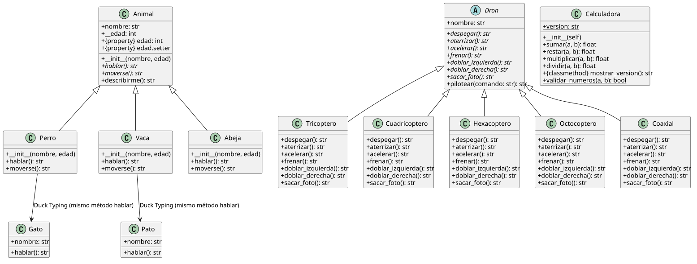

# Práctica 01 — Python OOP

> Algoritmos y Estructuras de Datos II — Unidad 02. Consignas teórico-prácticas sobre Programación Orientada a Objetos en Python.

## Stack Tecnológico

- **Lenguaje:** Python 3.11+
- **Frameworks:** solo biblioteca estándar (`abc`, `typing`)
- **Base de datos:** ninguna
- **Entorno:** venv

## Documentación del sistema

- [`docs/glosario-de-dominio.md`](docs/glosario-de-dominio.md) — términos clave del dominio POO
- [`docs/registro-necesidades.md`](docs/registro-necesidades.md) — requisitos funcionales (RN-001 a RN-018)

## Arquitectura

Cuatro aplicaciones independientes que cubren distintos conceptos POO, sin dependencia entre sí. Cada una reside en su propio módulo dentro de `app/`.



## Scaffolding

```
code/
├── app/
│   ├── ej_1_7_poo_basico.py          # Calculadora OOP: atributos, métodos instancia/clase/estáticos
│   ├── app_herencia_animales.py       # Herencia Animal + @property + encapsulamiento + setters
│   ├── app_drones_abc.py              # ABC Dron + 5 subtipos + menú interactivo por consola
│   └── app_duck_typing.py             # Duck Typing: lista heterogénea con método .hablar()
├── docs/
│   ├── glosario-de-dominio.md
│   ├── registro-necesidades.md
│   └── diagrams/
│       ├── diagrama-clases.puml       # editable
│       └── diagrama-clases.svg        # renderizado (pre-generado)
├── .gitignore
├── requirements.txt
└── README.md
```

## Setup y ejecución

### Prerrequisitos

- Python 3.11+
- `venv` (incluido en instalación estándar)
- Opcional: PlantUML (para re-renderizar diagramas)

### Instalación

```bash
python3 -m venv .venv
source .venv/bin/activate
pip install -r requirements.txt
```

### Ejecución

```bash
# App 1 — POO básico (Calculadora)
python3 -m app.ej_1_7_poo_basico

# App 2 — Herencia Animal + @property
python3 -m app.app_herencia_animales

# App 3 — Drones ABC (menú interactivo)
python3 -m app.app_drones_abc

# App 4 — Duck Typing
python3 -m app.app_duck_typing
```

Si se modificaron los diagramas, re-renderizar:

```bash
plantuml -tsvg docs/diagrams/*.puml
```

### Teardown

```bash
deactivate
rm -rf .venv
```

## Autor

Lapenta Carlos Matías — Algoritmos y Estructuras de Datos II
