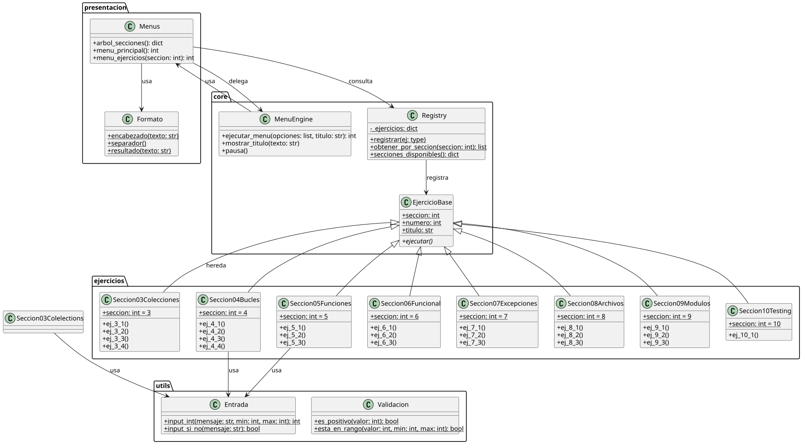
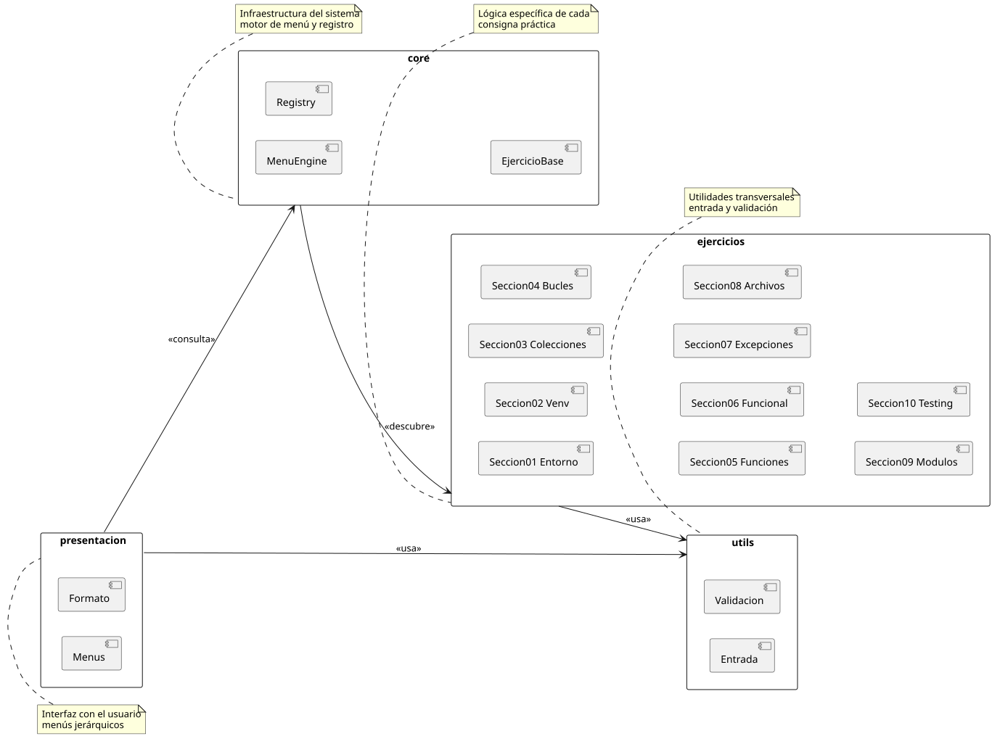

# Práctica 02 — Python Estructurado

> Menú CLI jerárquico con ejercicios prácticos de Python estructurado.

## Stack Tecnológico

- **Lenguaje:** Python 3.11+
- **Frameworks:** Flask (solo ej. 2.3)
- **Entorno:** `venv`

## Documentación del sistema

- [`docs/glosario-de-dominio.md`](docs/glosario-de-dominio.md) — términos clave del dominio
- [`docs/registro-necesidades.md`](docs/registro-necesidades.md) — requisitos funcionales

## Arquitectura

Sistema multicapa con registro de ejercicios vía decoradores.

- **`core/`** — infraestructura: motor de menú, registro de ejercicios
- **`ejercicios/`** — lógica específica de cada consigna (submódulos por sección)
- **`presentacion/`** — interfaz de usuario (menús, formato de salida)
- **`utils/`** — utilerías transversales (entrada validada)





## Scaffolding

```
code/
├── src/
│   ├── __init__.py
│   ├── __main__.py                   # Entry point: python -m src
│   ├── core/
│   │   ├── __init__.py
│   │   ├── menu_engine.py            # Motor de menú jerárquico
│   │   └── registry.py               # Registro de ejercicios (decoradores)
│   ├── ejercicios/
│   │   ├── __init__.py
│   │   ├── seccion_01_entorno.py
│   │   ├── seccion_02_venv.py
│   │   ├── seccion_03_colecciones.py
│   │   ├── seccion_04_bucles.py
│   │   ├── seccion_05_funciones.py
│   │   ├── seccion_06_funcional.py
│   │   ├── seccion_07_excepciones.py
│   │   ├── seccion_08_archivos.py
│   │   ├── seccion_09_modulos/
│   │   │   ├── __init__.py
│   │   │   ├── mi_paquete/
│   │   │   └── scripts/
│   │   └── seccion_10_testing/
│   │       ├── __init__.py
│   │       ├── funciones.py
│   │       └── tests.py
│   ├── presentacion/
│   │   ├── __init__.py
│   │   ├── menus.py
│   │   └── formato.py
│   └── utils/
│       ├── __init__.py
│       ├── entrada.py
│       └── validacion.py
├── docs/
│   ├── glosario-de-dominio.md
│   ├── registro-necesidades.md
│   └── diagrams/
│       ├── diagrama-clases.puml
│       ├── diagrama-clases.svg
│       ├── diagrama-arquitectura.puml
│       └── diagrama-arquitectura.svg
├── .gitignore
├── requirements.txt
└── README.md
```

## Setup y ejecución

### Prerrequisitos

- Python 3.11+
- Opcional: PlantUML (para re-renderizar diagramas)

### Instalación

```bash
cd code
python -m venv .venv
source .venv/bin/activate
pip install -r requirements.txt
```

### Ejecución

```bash
python -m src
```

### Tests

```bash
python -m unittest src.ejercicios.seccion_10_testing.tests -v
```

### Teardown

```bash
deactivate
rm -rf .venv
```

## Autor

Lapenta Carlos Matías — Algoritmos y Estructuras de Datos II
