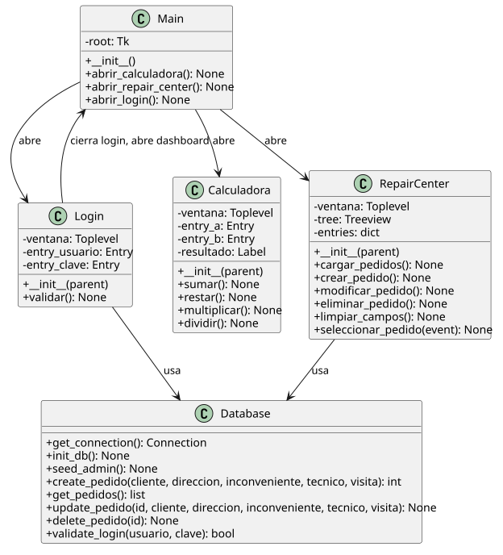
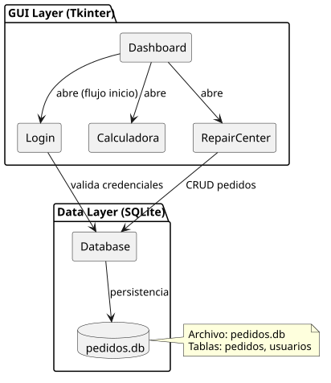

# Practica 03 — Python, Tkinter, SQLite

> Algoritmos y Estructuras de Datos II — Unidad 02. Consignas teorico-practicas sobre GUI con Tkinter y bases de datos con SQLite.

## Stack Tecnologico

- **Lenguaje:** Python 3.11+
- **GUI:** `tkinter` + `ttk` (biblioteca estandar)
- **Base de datos:** `sqlite3` (biblioteca estandar)
- **Entorno:** venv

## Documentacion del sistema

- [`docs/glosario-de-dominio.md`](docs/glosario-de-dominio.md) — terminos clave del dominio
- [`docs/registro-necesidades.md`](docs/registro-necesidades.md) — requisitos funcionales (RN-001 a RN-025)

## Arquitectura

Aplicacion unificada con menu dashboard. Arquitectura MVC simplificada:
- **Model:** `app/database.py` — capa de acceso a datos SQLite
- **View+Controller:** `app/calculadora.py`, `app/repair_center.py`, `app/login.py`
- **Entry point:** `app/main.py` — dashboard con menu principal




## Scaffolding

```
code/
├── app/
│   ├── __init__.py
│   ├── database.py              # Capa SQLite (conexion, tablas, CRUD, seed)
│   ├── calculadora.py           # GUI Calculadora (ej 3.1)
│   ├── repair_center.py         # GUI Repair Center (ej 3.2)
│   ├── login.py                 # GUI Login (ej 3.3)
│   └── main.py                  # Dashboard unificado
├── docs/
│   ├── glosario-de-dominio.md
│   ├── registro-necesidades.md
│   └── diagrams/
│       ├── diagrama-clases.puml
│       ├── diagrama-clases.svg
│       ├── diagrama-arquitectura.puml
│       └── diagrama-arquitectura.svg
├── .gitignore
├── requirements.txt
└── README.md
```

### Credenciales

Al iniciar la aplicacion por primera vez, se crea automaticamente un usuario administrador por defecto:

```
Usuario: admin
Clave:   admin123
```

## Setup y ejecucion

### Prerrequisitos

- Python 3.11+
- `venv` (incluido en instalacion estandar)
- Opcional: PlantUML (para re-renderizar diagramas)

### Instalacion

```bash
python3 -m venv .venv
source .venv/bin/activate
pip install -r requirements.txt
```

### Ejecucion

```bash
# Iniciar aplicacion (dashboard)
python3 -m app.main
```

### Componentes individuales

```bash
# Calculadora standalone
python3 -m app.calculadora

# Login standalone
python3 -m app.login
```

Si se modificaron los diagramas, re-renderizar:

```bash
plantuml -tsvg docs/diagrams/*.puml
```

### Teardown

```bash
deactivate
rm -rf .venv
```

## Credenciales por defecto

| Usuario | Clave | Rol |
|---|---|---|
| `admin` | `admin123` | Administrador |

## Autor

Lapenta Carlos Matias — Algoritmos y Estructuras de Datos II
