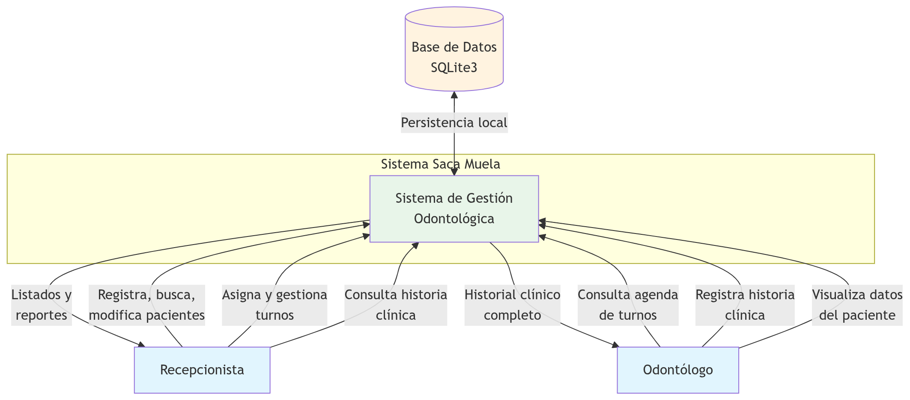

# Diagrama de Contexto — Saca Muela

System Boundary del sistema de gestión odontológica.

## Actores del Sistema

| Actor | Descripción | Responsabilidades |
| :--- | :--- | :--- |
| **Recepcionista** | Personal administrativo del consultorio | CRUD de pacientes, gestión de turnos, consulta de historia clínica |
| **Odontólogo** | Profesional de salud dental | Consulta de agenda, registro de historia clínica, visualización de datos del paciente |

## Fuera del Sistema (explícitamente excluido)

- Facturación / cobros
- Gestión de stock de insumos
- Módulo de estadísticas avanzadas
- Acceso remoto / web
- Gestión de usuarios con roles diferenciados (se asigna un único perfil por estación de trabajo)
