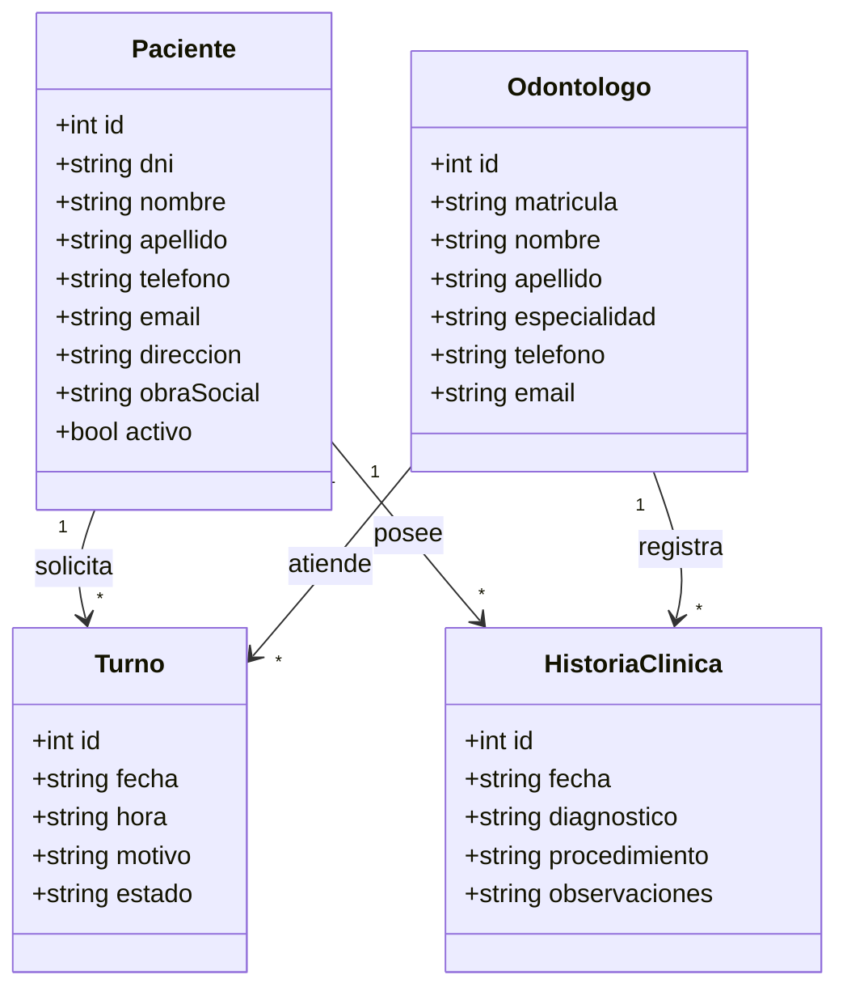

# Modelo Conceptual — Saca Muela

Diagrama de clases de dominio con entidades, atributos y relaciones del negocio odontológico.

## Entidades

| Entidad | Descripción |
| :--- | :--- |
| **Paciente** | Persona que recibe atención odontológica. Atributos demográficos y de contacto. |
| **Turno** | Cita programada que vincula paciente, odontólogo, fecha y hora. |
| **Odontólogo** | Profesional que brinda la atención. Identificado por matrícula. |
| **HistoriaClínica** | Registro cronológico de diagnósticos, procedimientos y observaciones por paciente. |

## Reglas de Relación

- Un `Paciente` puede tener **muchos** `Turno`s; un `Turno` pertenece a **un** `Paciente`.
- Un `Odontólogo` puede atender **muchos** `Turno`s; un `Turno` es atendido por **un** `Odontólogo`.
- Un `Paciente` puede tener **muchas** entradas de `HistoriaClinica`; cada entrada pertenece a **un** `Paciente`.
- Un `Odontólogo` puede registrar **muchas** entradas de `HistoriaClinica`; cada entrada es registrada por **un** `Odontólogo`.

> **Nota:** La lógica de negocio (registrar, modificar, asignar, confirmar, cancelar) no pertenece a las entidades de dominio. Se implementa en el módulo `Consultorio` (facade) dentro del package `consultorio/`, que orquesta validaciones, repositorios y la máquina de estados de Turno.
