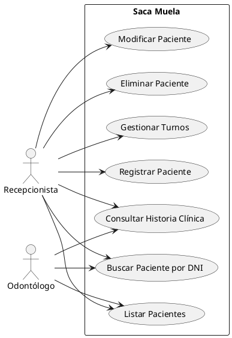

# Especificación de Requisitos de Software (SRS)

**Proyecto:** Saca Muela — Sistema de Gestión Odontológica
**Fecha:** 08/06/2026
**Versión:** 1.0

---

## Ficha del Documento

| Fecha      | Revisión | Autor                  | Verificado por |
| :--------- | :------- | :--------------------- | :------------- |
| 08/06/2026 | 1.0      | Lapenta, Carlos Matías | —              |

**Validación por las partes:**

- **Por el proveedor:** Lapenta, Carlos Matías
- **Por el cliente:** Consultorio Odontológico "Saca Muela"

---

## Índice

- [Ficha del Documento](#Ficha%20del%20Documento)
- [Índice](#%C3%8Dndice)
- [1. Introducción](#1.%20Introducci%C3%B3n)
	- [1.1 Propósito](#1.1%20Prop%C3%B3sito)
	- [1.2 Alcance](#1.2%20Alcance)
	- [1.3 Personal Involucrado](#1.3%20Personal%20Involucrado)
	- [1.4 Definiciones, acrónimos y abreviaturas](#1.4%20Definiciones,%20acr%C3%B3nimos%20y%20abreviaturas)
	- [1.5 Referencias](#1.5%20Referencias)
	- [1.6 Resumen](#1.6%20Resumen)
	- [1.7 Glosario de Términos](#1.7%20Glosario%20de%20T%C3%A9rminos)
- [2. Descripción General](#2.%20Descripci%C3%B3n%20General)
	- [2.1 Perspectiva del Producto](#2.1%20Perspectiva%20del%20Producto)
	- [2.2 Funcionalidad del Producto](#2.2%20Funcionalidad%20del%20Producto)
	- [2.3 Características de los Usuarios](#2.3%20Caracter%C3%ADsticas%20de%20los%20Usuarios)
	- [2.4 Restricciones](#2.4%20Restricciones)
	- [2.5 Suposiciones y Dependencias](#2.5%20Suposiciones%20y%20Dependencias)
- [3. Requisitos Específicos](#3.%20Requisitos%20Espec%C3%ADficos)
	- [3.1 Requisitos Comunes de las Interfaces](#3.1%20Requisitos%20Comunes%20de%20las%20Interfaces)
	- [3.2 Requerimientos Funcionales (RF)](#3.2%20Requerimientos%20Funcionales%20(RF))
	- [3.3 Requerimientos de Dominio (RD)](#3.3%20Requerimientos%20de%20Dominio%20(RD))
	- [3.4 Requerimientos No Funcionales (RNF)](#3.4%20Requerimientos%20No%20Funcionales%20(RNF))
- [4. Casos de Uso](#4.%20Casos%20de%20Uso)
	- [4.1 Diagrama de Casos de Uso](#4.1%20Diagrama%20de%20Casos%20de%20Uso)
	- [4.2 Especificación de Casos de Uso](#4.2%20Especificaci%C3%B3n%20de%20Casos%20de%20Uso)
		- [CU-01: Registrar Paciente](#CU-01:%20Registrar%20Paciente)
		- [CU-02: Buscar Paciente por DNI](#CU-02:%20Buscar%20Paciente%20por%20DNI)
		- [CU-03: Listar Pacientes](#CU-03:%20Listar%20Pacientes)
		- [CU-04: Modificar Paciente](#CU-04:%20Modificar%20Paciente)
		- [CU-05: Eliminar Paciente](#CU-05:%20Eliminar%20Paciente)
		- [CU-06: Gestionar Turno](#CU-06:%20Gestionar%20Turno)
		- [CU-07: Consultar Historia Clínica](#CU-07:%20Consultar%20Historia%20Cl%C3%ADnica)
	- [4.3 Matriz de Trazabilidad](#4.3%20Matriz%20de%20Trazabilidad)
- [5. Anexo: Priorización MoSCoW](#5.%20Anexo:%20Priorizaci%C3%B3n%20MoSCoW)

---

## 1. Introducción

### 1.1 Propósito

Este documento especifica los requisitos funcionales, no funcionales y de dominio para el desarrollo del sistema de gestión odontológica "Saca Muela". Está dirigido al equipo de desarrollo como contrato de alcance y a los stakeholders como medio de validación.

### 1.2 Alcance

El sistema permitirá digitalizar la gestión de pacientes de un consultorio odontológico, optimizando la atención y el seguimiento de tratamientos mediante una aplicación de escritorio. Quedan fuera del alcance: facturación, gestión de stock, acceso web y estadísticas avanzadas.

### 1.3 Personal Involucrado

| Nombre | Rol | Categoría Profesional | Responsabilidad | Contacto |
| :--- | :--- | :--- | :--- | :--- |
| Lapenta, Carlos Matías | Analista / Desarrollador | Técnico Analista de Sistemas | Análisis, desarrollo e implementación del sistema | — |

### 1.4 Definiciones, acrónimos y abreviaturas

| Término / Sigla | Descripción |
| :--- | :--- |
| **SRS** | Software Requirements Specification (Especificación de Requisitos de Software) |
| **CRUD** | Create, Read, Update, Delete — operaciones básicas de persistencia |
| **RF** | Requerimiento Funcional |
| **RNF** | Requerimiento No Funcional |
| **RD** | Requerimiento de Dominio |
| **CU** | Caso de Uso |
| **SQLite3** | Motor de base de datos SQL embebido |
| **ttk** | Módulo de widgets temáticos de Tkinter para Python |

### 1.5 Referencias

| Título del Documento | Referencia / Enlace |
| :--- | :--- |
| IEEE Std 830-1998 | Recommended Practice for Software Requirements Specifications |
| Glosario de Dominio — Saca Muela | `glosario-de-dominio.md` |
| Modelo Conceptual — Saca Muela | `modelo-conceptual.md` |

### 1.6 Resumen

Este documento está organizado en cuatro secciones principales: la introducción presenta el propósito, alcance y contexto del proyecto; la descripción general detalla la perspectiva del producto, funcionalidad, usuarios objetivo y restricciones; los requisitos específicos definen los requerimientos funcionales, de dominio y no funcionales con sus prioridades; finalmente, los casos de uso describen los flujos de interacción.

### 1.7 Glosario de Términos

| Término | Definición |
| :--- | :--- |
| **Paciente** | Persona que asiste al consultorio para recibir atención odontológica. |
| **Turno** | Cita programada que vincula a un paciente con un odontólogo en una fecha y hora determinadas. |
| **Odontólogo** | Profesional de la salud dental que brinda la atención. |
| **Historia Clínica** | Registro cronológico de diagnósticos, procedimientos y observaciones clínicas. |
| **DNI duplicado** | Intento de registrar un DNI ya existente en el sistema. |
| **Baja lógica** | Eliminación no física: el registro se marca como inactivo pero se conserva. |

---

## 2. Descripción General

### 2.1 Perspectiva del Producto

El sistema es una aplicación de escritorio autónoma que opera con persistencia local (SQLite3). Sigue una arquitectura de dos capas separadas: capa de datos (`consultorio.py`) y capa de interfaz (`formulario_odontologico.py`). No depende de servicios externos ni de conexión a internet.

### 2.2 Funcionalidad del Producto

- CRUD completo de pacientes (registrar, buscar, listar, modificar, eliminar)
- Gestión de turnos (asignar, confirmar, cancelar)
- Registro y consulta de historia clínica
- Búsqueda rápida por DNI
- Interfaz gráfica basada en pestañas (ttk.Notebook)

### 2.3 Características de los Usuarios

| Tipo de Usuario | Formación / Nivel Técnico | Actividades Principales |
| :--- | :--- | :--- |
| Recepcionista | Básico en informática | CRUD de pacientes, gestión de turnos, consulta de historia clínica |
| Odontólogo | Básico en informática | Consulta de agenda y pacientes, registro de historia clínica |

### 2.4 Restricciones

- **Lenguaje:** Python 3.x
- **Persistencia:** SQLite3 (prohibido el uso de servidores de bases de datos externos)
- **Interfaz gráfica:** ttk (Tkinter themed widgets) con ttk.Notebook para pestañas
- **Arquitectura:** Separación estricta en dos módulos: `consultorio.py` (capa de datos/negocio) y `formulario_odontologico.py` (capa de interfaz)
- **Plataforma:** Aplicación de escritorio (Windows/Linux)

### 2.5 Suposiciones y Dependencias

- Se asume que el usuario tiene Python 3.x instalado con soporte para Tkinter y SQLite3.
- Se asume que el sistema operativo es Windows o Linux con entorno gráfico disponible.
- Se asume que el consultorio cuenta con una única estación de trabajo para la ejecución del sistema.

---

## 3. Requisitos Específicos

### 3.1 Requisitos Comunes de las Interfaces

- **3.1.1 Interfaces de usuario:** Ventanas con widgets ttk. Navegación por pestañas (ttk.Notebook). Formularios con campos de texto, botones y tablas (ttk.Treeview). Mensajes de error mediante diálogos modales.
- **3.1.2 Interfaces de hardware:** PC con monitor, teclado y mouse. No se requieren periféricos especializados.
- **3.1.3 Interfaces de software:** Sistema operativo con Python 3.x, Tkinter y SQLite3.
- **3.1.4 Interfaces de comunicación:** Sin interfaces de red. Operación completamente local.

### 3.2 Requerimientos Funcionales (RF)

| Identificación: | **RF-01** |
| :--- | :--- |
| **Nombre:** | Registrar Paciente |
| **Actor(es):** | Recepcionista |
| **Caso de Uso asociado:** | CU-01 |
| **Características:** | El sistema debe permitir el alta de un nuevo paciente en la base de datos |
| **Descripción:** | El usuario completa un formulario con datos del paciente (DNI, nombre, apellido, teléfono, email, dirección, obra social). El sistema valida que el DNI no esté duplicado y que los campos obligatorios estén completos. Si la validación es exitosa, persiste el registro y lo muestra en la lista de pacientes. |
| **Prioridad:** | Alta |

| Identificación: | **RF-02** |
| :--- | :--- |
| **Nombre:** | Buscar Paciente por DNI |
| **Actor(es):** | Recepcionista, Odontólogo |
| **Caso de Uso asociado:** | CU-02 |
| **Características:** | El sistema debe permitir buscar pacientes por su número de DNI |
| **Descripción:** | El usuario ingresa un DNI en un campo de búsqueda. El sistema consulta la base de datos y, si existe, muestra los datos del paciente. Si no existe, informa al usuario. |
| **Prioridad:** | Alta |

| Identificación: | **RF-03** |
| :--- | :--- |
| **Nombre:** | Listar Pacientes |
| **Actor(es):** | Recepcionista, Odontólogo |
| **Caso de Uso asociado:** | CU-03 |
| **Características:** | El sistema debe mostrar un listado de todos los pacientes registrados |
| **Descripción:** | El sistema despliega una tabla con todos los pacientes activos, mostrando DNI, nombre, apellido y teléfono. Permite ordenar por cualquier columna. |
| **Prioridad:** | Alta |

| Identificación: | **RF-04** |
| :--- | :--- |
| **Nombre:** | Modificar Paciente |
| **Actor(es):** | Recepcionista |
| **Caso de Uso asociado:** | CU-04 |
| **Características:** | El sistema debe permitir actualizar los datos de un paciente existente |
| **Descripción:** | El usuario selecciona un paciente del listado, modifica los campos deseados y confirma los cambios. El sistema valida los datos y persiste las modificaciones. El DNI no puede modificarse. |
| **Prioridad:** | Alta |

| Identificación: | **RF-05** |
| :--- | :--- |
| **Nombre:** | Eliminar Paciente |
| **Actor(es):** | Recepcionista |
| **Caso de Uso asociado:** | CU-05 |
| **Características:** | El sistema debe permitir eliminar (baja lógica) un paciente |
| **Descripción:** | El usuario selecciona un paciente y solicita su eliminación. El sistema solicita confirmación. Al confirmar, marca el paciente como inactivo sin borrar físicamente el registro. El paciente eliminado no aparece en los listados por defecto. |
| **Prioridad:** | Alta |

| Identificación: | **RF-06** |
| :--- | :--- |
| **Nombre:** | Gestionar Turnos |
| **Actor(es):** | Recepcionista |
| **Caso de Uso asociado:** | CU-06 |
| **Características:** | El sistema debe permitir asignar, confirmar y cancelar turnos |
| **Descripción:** | El usuario selecciona un paciente, elige un odontólogo, fecha y hora, y asigna un turno. El sistema verifica que no exista superposición horaria para el mismo odontólogo/consultorio. El turno puede confirmarse o cancelarse posteriormente. |
| **Prioridad:** | Alta |

| Identificación: | **RF-07** |
| :--- | :--- |
| **Nombre:** | Consultar Historia Clínica |
| **Actor(es):** | Odontólogo, Recepcionista |
| **Caso de Uso asociado:** | CU-07 |
| **Características:** | El sistema debe mostrar el historial clínico de un paciente |
| **Descripción:** | El usuario selecciona un paciente y accede a su historia clínica. El sistema muestra un listado cronológico con fecha, odontólogo actuante, diagnóstico, procedimiento y observaciones. |
| **Prioridad:** | Media |

### 3.3 Requerimientos de Dominio (RD)

| Identificación: | **RD-01** |
| :--- | :--- |
| **Nombre:** | Unicidad del DNI |
| **Regla:** | El DNI del paciente debe ser único e irrepetible en toda la base de datos |
| **Descripción:** | No pueden existir dos pacientes con el mismo número de DNI. El sistema debe impedir el alta o modificación que genere un DNI duplicado. |
| **Prioridad:** | Alta |

| Identificación: | **RD-02** |
| :--- | :--- |
| **Nombre:** | Teléfono obligatorio para turnos |
| **Regla:** | El teléfono del paciente es obligatorio para poder asignarle un turno |
| **Descripción:** | El sistema debe exigir que el campo teléfono del paciente esté completo antes de permitir la asignación de un turno. |
| **Prioridad:** | Alta |

| Identificación: | **RD-03** |
| :--- | :--- |
| **Nombre:** | No superposición de turnos |
| **Regla:** | No pueden existir dos turnos asignados al mismo odontólogo con fecha y hora superpuestas |
| **Descripción:** | El sistema debe validar que el odontólogo esté disponible en la franja horaria solicitada antes de confirmar un turno. |
| **Prioridad:** | Alta |

| Identificación: | **RD-04** |
| :--- | :--- |
| **Nombre:** | Conservación de datos del paciente |
| **Regla:** | Los datos del paciente deben conservarse aunque no tenga turnos activos |
| **Descripción:** | La eliminación de un paciente es siempre lógica. No se permite la eliminación física del registro. |
| **Prioridad:** | Media |

| Identificación: | **RD-05** |
| :--- | :--- |
| **Nombre:** | Trazabilidad clínica |
| **Regla:** | Cada entrada de historia clínica debe registrar fecha, odontólogo actuante, diagnóstico y procedimiento |
| **Descripción:** | No se permite registrar una entrada de historia clínica sin completar estos campos mínimos. |
| **Prioridad:** | Alta |

### 3.4 Requerimientos No Funcionales (RNF)

| Identificación: | **RNF-01** |
| :--- | :--- |
| **Nombre:** | Tiempo de respuesta |
| **Características:** | Las operaciones CRUD deben completarse en menos de 2 segundos |
| **Descripción:** | Toda operación de alta, búsqueda, listado, modificación o eliminación debe responder al usuario en menos de 2 segundos en condiciones normales de operación. |
| **Prioridad:** | Alta |

| Identificación: | **RNF-02** |
| :--- | :--- |
| **Nombre:** | Facilidad de uso |
| **Características:** | La interfaz debe ser intuitiva para usuarios sin formación técnica |
| **Descripción:** | La navegación debe organizarse en pestañas claramente etiquetadas. Los formularios deben incluir etiquetas descriptivas. Las operaciones críticas (eliminar, modificar) deben solicitar confirmación antes de ejecutarse. Los mensajes de error deben ser informativos y en lenguaje de negocio, no técnico. |
| **Prioridad:** | Alta |

| Identificación: | **RNF-03** |
| :--- | :--- |
| **Nombre:** | Manejo de errores |
| **Características:** | El sistema debe manejar todas las entradas inválidas sin interrumpir la ejecución |
| **Descripción:** | Ante datos inválidos (DNI con formato incorrecto, campos vacíos obligatorios, tipos de datos incorrectos), el sistema debe mostrar un mensaje de error claro y permitir al usuario corregir la entrada sin perder los datos ya ingresados en el formulario. |
| **Prioridad:** | Alta |

| Identificación: | **RNF-04** |
| :--- | :--- |
| **Nombre:** | Separación de capas |
| **Características:** | La lógica de negocio y la interfaz de usuario deben residir en módulos independientes |
| **Descripción:** | El módulo `consultorio.py` contiene toda la lógica de negocio y acceso a datos. El módulo `formulario_odontologico.py` contiene exclusivamente la interfaz gráfica. No debe haber código de interfaz en `consultorio.py` ni consultas SQL en `formulario_odontologico.py`. |
| **Prioridad:** | Alta |

| Identificación: | **RNF-05** |
| :--- | :--- |
| **Nombre:** | Persistencia local con SQLite3 |
| **Características:** | Todos los datos deben almacenarse en una base de datos SQLite3 local |
| **Descripción:** | El sistema no debe depender de servidores externos ni de conexión de red. La base de datos debe residir en un archivo `.db` en el mismo directorio de la aplicación. |
| **Prioridad:** | Alta |

| Identificación: | **RNF-06** |
| :--- | :--- |
| **Nombre:** | Portabilidad |
| **Características:** | La aplicación debe ejecutarse en Windows y Linux sin modificaciones |
| **Descripción:** | No deben utilizarse librerías o funcionalidades dependientes de plataforma. El código debe ser compatible con Python 3.x estándar en ambos sistemas operativos. |
| **Prioridad:** | Media |

---

## 4. Casos de Uso

### 4.1 Diagrama de Casos de Uso

### 4.2 Especificación de Casos de Uso

#### CU-01: Registrar Paciente

| Campo | Descripción |
| :--- | :--- |
| **Actor:** | Recepcionista |
| **Precondiciones:** | El sistema está iniciado y muestra la pantalla principal. |
| **Postcondiciones:** | Un nuevo paciente es persistido en la base de datos y visible en el listado. |
| **Curso Normal (Flujo Principal):** | 1. El usuario selecciona la pestaña "Registrar Paciente". 2. El sistema muestra un formulario vacío con los campos: DNI, nombre, apellido, teléfono, email, dirección, obra social. 3. El usuario completa los campos y presiona "Guardar". 4. El sistema valida que el DNI no exista y que los campos obligatorios estén completos. 5. El sistema persiste el registro y muestra un mensaje de éxito. 6. El sistema actualiza el listado de pacientes. |
| **Cursos Alternativos:** | **A1 — DNI duplicado:** Si el DNI ya existe, el sistema muestra un mensaje de error y no persiste el registro. El formulario conserva los datos ingresados. **A2 — Campos obligatorios incompletos:** Si falta algún campo obligatorio, el sistema resalta los campos faltantes y no persiste. |
| **RF Asociados:** | RF-01 |
| **Prioridad:** | Alta |

#### CU-02: Buscar Paciente por DNI

| Campo | Descripción |
| :--- | :--- |
| **Actor:** | Recepcionista, Odontólogo |
| **Precondiciones:** | Existe al menos un paciente registrado. |
| **Postcondiciones:** | Los datos del paciente son mostrados en pantalla. |
| **Curso Normal:** | 1. El usuario ingresa un DNI en el campo de búsqueda. 2. El usuario presiona "Buscar" o presiona Enter. 3. El sistema consulta la base de datos. 4. El sistema muestra los datos del paciente encontrado. |
| **Cursos Alternativos:** | **A1 — Paciente no encontrado:** El sistema muestra un mensaje indicando que no existe paciente con ese DNI. |
| **RF Asociados:** | RF-02 |
| **Prioridad:** | Alta |

#### CU-03: Listar Pacientes

| Campo | Descripción |
| :--- | :--- |
| **Actor:** | Recepcionista, Odontólogo |
| **Precondiciones:** | Existe al menos un paciente registrado. |
| **Postcondiciones:** | El listado de pacientes activos se muestra en pantalla. |
| **Curso Normal:** | 1. El usuario selecciona la pestaña "Listado de Pacientes". 2. El sistema consulta todos los pacientes activos. 3. El sistema muestra una tabla con DNI, nombre, apellido y teléfono. |
| **Cursos Alternativos:** | **A1 — Sin pacientes:** Si no hay pacientes registrados, el sistema muestra una tabla vacía con un mensaje indicativo. |
| **RF Asociados:** | RF-03 |
| **Prioridad:** | Alta |

#### CU-04: Modificar Paciente

| Campo | Descripción |
| :--- | :--- |
| **Actor:** | Recepcionista |
| **Precondiciones:** | El paciente existe en la base de datos y fue seleccionado del listado. |
| **Postcondiciones:** | Los datos del paciente son actualizados en la base de datos. |
| **Curso Normal:** | 1. El usuario selecciona un paciente del listado. 2. El usuario presiona "Modificar". 3. El sistema carga los datos del paciente en un formulario editable. 4. El usuario modifica los campos deseados. 5. El usuario presiona "Guardar Cambios". 6. El sistema valida los datos y persiste las modificaciones. |
| **Cursos Alternativos:** | **A1 — DNI no modificable:** Si el usuario intenta modificar el DNI, el sistema rechaza la operación. **A2 — Datos inválidos:** El sistema rechaza cambios con datos inválidos y muestra mensaje de error. |
| **RF Asociados:** | RF-04 |
| **Prioridad:** | Alta |

#### CU-05: Eliminar Paciente

| Campo | Descripción |
| :--- | :--- |
| **Actor:** | Recepcionista |
| **Precondiciones:** | El paciente existe en la base de datos y fue seleccionado del listado. |
| **Postcondiciones:** | El paciente es marcado como inactivo (baja lógica) y desaparece del listado por defecto. |
| **Curso Normal:** | 1. El usuario selecciona un paciente del listado. 2. El usuario presiona "Eliminar". 3. El sistema muestra un diálogo de confirmación. 4. El usuario confirma la eliminación. 5. El sistema marca el paciente como inactivo. 6. El sistema actualiza el listado. |
| **Cursos Alternativos:** | **A1 — Cancelación:** Si el usuario cancela la confirmación, no se realiza ninguna acción. |
| **RF Asociados:** | RF-05 |
| **Prioridad:** | Alta |

#### CU-06: Gestionar Turno

| Campo | Descripción |
| :--- | :--- |
| **Actor:** | Recepcionista |
| **Precondiciones:** | El paciente existe en la base de datos y tiene teléfono registrado. Existe al menos un odontólogo en el sistema. |
| **Postcondiciones:** | Un turno es creado, confirmado o cancelado según la acción del usuario. |
| **Curso Normal (Asignar):** | 1. El usuario selecciona un paciente. 2. El usuario presiona "Asignar Turno". 3. El sistema verifica que el paciente tenga teléfono registrado. 4. El usuario selecciona odontólogo, fecha y hora. 5. El sistema verifica disponibilidad del odontólogo. 6. El sistema persiste el turno con estado "Pendiente". |
| **Cursos Alternativos:** | **A1 — Sin teléfono:** Si el paciente no tiene teléfono, el sistema rechaza la asignación y solicita completar el dato. **A2 — Superposición horaria:** Si el odontólogo ya tiene un turno en esa fecha/hora, el sistema informa al usuario y solicita otra hora. **A3 — Confirmar turno:** El usuario selecciona un turno pendiente y presiona "Confirmar". El sistema cambia el estado a "Confirmado". **A4 — Cancelar turno:** El usuario selecciona un turno y presiona "Cancelar". El sistema cambia el estado a "Cancelado". |
| **RF Asociados:** | RF-06 |
| **Prioridad:** | Alta |

#### CU-07: Consultar Historia Clínica

| Campo | Descripción |
| :--- | :--- |
| **Actor:** | Odontólogo, Recepcionista |
| **Precondiciones:** | El paciente existe en la base de datos y tiene al menos una entrada en su historia clínica. |
| **Postcondiciones:** | El historial clínico del paciente se muestra en pantalla. |
| **Curso Normal:** | 1. El usuario selecciona un paciente. 2. El usuario presiona "Ver Historia Clínica". 3. El sistema muestra un listado cronológico con fecha, odontólogo, diagnóstico, procedimiento y observaciones. 4. El usuario puede agregar una nueva entrada completando los campos correspondientes y presionando "Registrar". |
| **Cursos Alternativos:** | **A1 — Sin historial:** Si el paciente no tiene entradas, el sistema muestra un mensaje y permite registrar la primera entrada. |
| **RF Asociados:** | RF-07 |
| **Prioridad:** | Media |

### 4.3 Matriz de Trazabilidad

| ID | Descripción | Fuente | Caso de Uso | Prioridad |
| :--- | :--- | :--- | :--- | :--- |
| **RF-01** | Registrar Paciente | Cuadro Hito 0 | CU-01 | Alta |
| **RF-02** | Buscar Paciente por DNI | Cuadro Hito 0 | CU-02 | Alta |
| **RF-03** | Listar Pacientes | Cuadro Hito 0 | CU-03 | Alta |
| **RF-04** | Modificar Paciente | Cuadro Hito 0 | CU-04 | Alta |
| **RF-05** | Eliminar Paciente | Cuadro Hito 0 | CU-05 | Alta |
| **RF-06** | Gestionar Turnos | Investigación web | CU-06 | Alta |
| **RF-07** | Consultar Historia Clínica | Párrafo idea | CU-07 | Media |
| **RD-01** | Unicidad del DNI | Cuadro Hito 0 | CU-01, CU-04 | Alta |
| **RD-02** | Teléfono obligatorio para turnos | Cuadro Hito 0 | CU-06 | Alta |
| **RD-03** | No superposición de turnos | Análisis | CU-06 | Alta |
| **RD-04** | Conservación de datos del paciente | Análisis | CU-05 | Media |
| **RD-05** | Trazabilidad clínica | Análisis | CU-07 | Alta |
| **RNF-01** | Tiempo de respuesta | Cuadro Hito 0 | — | Alta |
| **RNF-02** | Facilidad de uso | Cuadro Hito 0 | — | Alta |
| **RNF-03** | Manejo de errores | Cuadro Hito 0 | — | Alta |
| **RNF-04** | Separación de capas | Hito 2 | — | Alta |
| **RNF-05** | Persistencia local SQLite3 | Hito 2 | — | Alta |
| **RNF-06** | Portabilidad | Análisis | — | Media |

---

## 5. Anexo: Priorización MoSCoW

| Categoría | Requisitos incluidos |
| :--- | :--- |
| **Must Have** | RF-01, RF-02, RF-03, RF-04, RF-05, RF-06; RD-01, RD-02, RD-03, RD-05; RNF-01, RNF-02, RNF-03, RNF-04, RNF-05 |
| **Should Have** | RF-07; RD-04 |
| **Could Have** | RNF-06 |
| **Won't Have** | Facturación, stock, acceso web, estadísticas |
