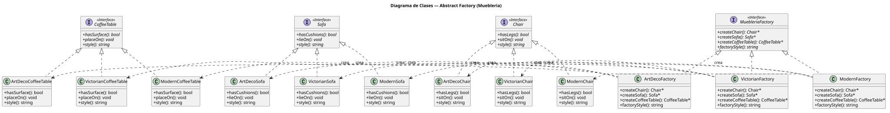
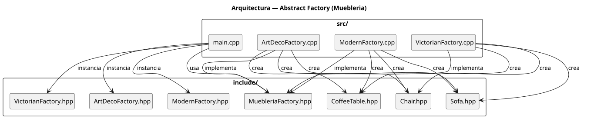

# Practica 05 — Patrones Creacionales (Abstract Factory)

> Aplicación C++ que implementa el patrón Abstract Factory para la creación de familias de muebles (Chair, Sofa, CoffeeTable) en tres variantes: Modern, Victorian y ArtDeco.

## Stack Tecnológico

- **Lenguaje:** C++17
- **Compilador:** g++
- **Build:** Makefile
- **Dependencias:** ninguna (STL únicamente)

## Documentación del sistema

- [`docs/glosario-de-dominio.md`](docs/glosario-de-dominio.md) — términos clave del dominio
- [`docs/registro-necesidades.md`](docs/registro-necesidades.md) — requisitos funcionales y no funcionales

## Arquitectura

Se aplica el patrón **Abstract Factory** (GoF). El cliente (`main.cpp`) recibe una `MuebleriaFactory` abstracta y opera sobre interfaces (`Chair`, `Sofa`, `CoffeeTable`), sin conocer las clases concretas. Cada fábrica concreta (`ModernFactory`, `VictorianFactory`, `ArtDecoFactory`) produce únicamente productos de su variante, garantizando la consistencia de la familia.





## Scaffolding

```
code/
├── Makefile
├── README.md
├── .gitignore
├── include/
│   ├── Chair.hpp
│   ├── Sofa.hpp
│   ├── CoffeeTable.hpp
│   ├── MuebleriaFactory.hpp
│   ├── ModernFactory.hpp
│   ├── VictorianFactory.hpp
│   └── ArtDecoFactory.hpp
├── src/
│   ├── main.cpp
│   ├── ModernFactory.cpp
│   ├── VictorianFactory.cpp
│   └── ArtDecoFactory.cpp
└── docs/
    ├── glosario-de-dominio.md
    ├── registro-necesidades.md
    └── diagrams/
        ├── diagrama-clases.puml
        ├── diagrama-clases.svg
        ├── diagrama-arquitectura.puml
        └── diagrama-arquitectura.svg
```

## Setup y ejecución

### Prerrequisitos

- `g++` con soporte C++17
- `make`
- Opcional: `plantuml` (para re-renderizar diagramas)

### Compilación

```bash
make
```

### Ejecución

```bash
make run
```

### Limpieza

```bash
make clean
```

### Re-renderizar diagramas

```bash
plantuml -tsvg docs/diagrams/*.puml
```

## Autor

Carlos Matías Lapenta — Algoritmos y Estructuras de Datos II
