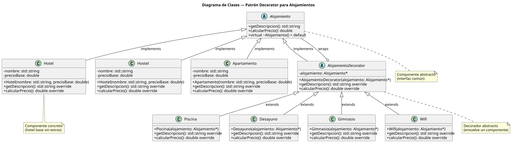

# Sistema de Presupuesto de Alojamientos — Patrón Decorator

> Aplicación C++ que aplica el patrón estructural **Decorator** para construir presupuestos de alojamientos con características opcionales.

## Stack Tecnológico

- **Lenguaje:** C++17
- **Compilador:** g++ (GCC)
- **Build System:** GNU Make
- **Dependencias:** STL únicamente (sin librerías externas)

## Documentación del sistema

- [`docs/glosario-de-dominio.md`](docs/glosario-de-dominio.md) — términos clave del dominio
- [`docs/registro-necesidades.md`](docs/registro-necesidades.md) — requisitos funcionales

## Arquitectura

El sistema implementa el patrón **Decorator** con la siguiente estructura:

- `Alojamiento` — clase abstracta (interfaz común con `getDescripcion()` y `calcularPrecio()`)
- `Hotel`, `Hostel`, `Apartamento` — componentes concretos (alojamientos base)
- `AlojamientoDecorator` — decorador abstracto que envuelve un `Alojamiento`
- `Piscina`, `Desayuno`, `Gimnasio`, `Wifi` — decoradores concretos que agregan costo y descripción

Esta arquitectura permite:
- Agregar características a un alojamiento sin modificar su clase
- Apilar múltiples decoradores combinados
- Extender el sistema con nuevos tipos de alojamiento (solo crear nueva subclase de `Alojamiento`)



## Scaffolding

```
code/
├── include/
│   ├── Alojamiento.hpp           # Interfaz abstracta
│   ├── Hotel.hpp                 # Componente concreto
│   ├── Hostel.hpp                # Componente concreto (extensibilidad)
│   ├── Apartamento.hpp           # Componente concreto (extensibilidad)
│   ├── AlojamientoDecorator.hpp  # Decorador abstracto
│   ├── Piscina.hpp               # Decorador concreto
│   ├── Desayuno.hpp              # Decorador concreto
│   ├── Gimnasio.hpp              # Decorador concreto
│   └── Wifi.hpp                  # Decorador concreto
├── src/
│   ├── main.cpp                  # Punto de entrada (demo)
│   ├── Hotel.cpp
│   ├── Hostel.cpp
│   ├── Apartamento.cpp
│   ├── AlojamientoDecorator.cpp
│   ├── Piscina.cpp
│   ├── Desayuno.cpp
│   ├── Gimnasio.cpp
│   └── Wifi.cpp
├── obj/                          # Objetos compilados (gitignored)
├── docs/
│   ├── glosario-de-dominio.md
│   ├── registro-necesidades.md
│   └── diagrams/
│       ├── diagrama-clases.puml
│       └── diagrama-clases.svg
├── Makefile
├── .gitignore
└── README.md
```

## Setup y ejecución

### Prerrequisitos

- g++ con soporte C++17
- GNU Make
- Opcional: PlantUML (para re-renderizar diagramas)

### Compilación

```bash
make
```

### Ejecución

```bash
make run
```

### Limpieza

```bash
make clean
```

Si se modificaron los diagramas, re-renderizar:

```bash
plantuml -tsvg docs/diagrams/*.puml
```

## Autor

Lapenta Carlos Matías — Algoritmos y Estructuras de Datos II
